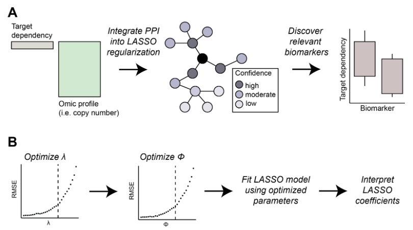

## Bio-primed machine learning to enhance discovery of relevant biomarkers

  

A) Overview of the method. Biomarker discovery analysis associates the dependency of the target gene with a genome-wide omic profile. Information from biological networks, such as protein-protein interaction networks, is integrated into the LASSO regularization, bio-primed model. As a consequence, features that are linked to the target dependency are prioritized during the feature selection resulting in the discovery of relevant biomarkers. B) Stepwise parameterization procedure first optimizes λ then second optimizes the Φ parameter. Using the optimized λ and Φ parameters a final LASSO model is fit, and the resulting coefficients can be inspected to prioritize biologically relevant biomarkers.

## Data
Google drive [folder](https://drive.google.com/drive/folders/18qWHdnu21K0aAePUU8b-01XK003_Y-3n?usp=sharing) with additional results & draft of manuscript:

